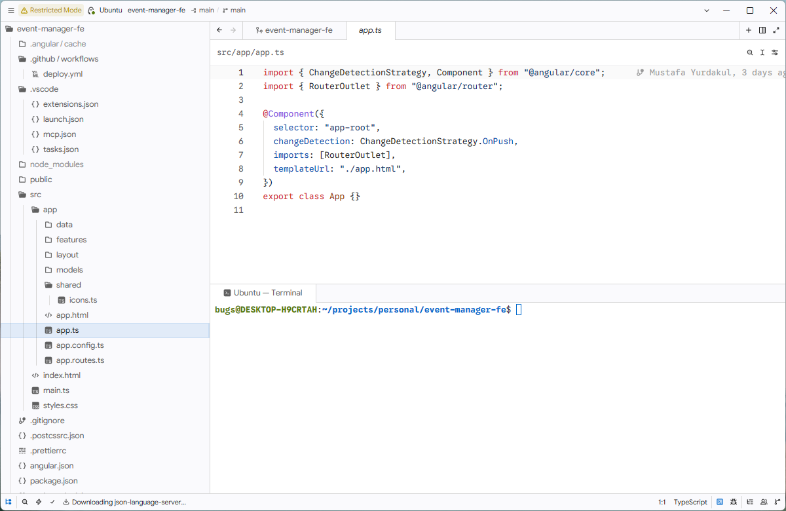

# VS Code 2026 — Theme for Zed

A faithful port of the VS Code 2026 light and dark themes to [Zed](https://zed.dev), built directly from the original theme sources in [microsoft/vscode](https://github.com/microsoft/vscode/tree/main/extensions/theme-defaults/themes).

## Preview

### Dark



### Light


## Faithful to the source

This is not an approximation or a look-alike. Every color in this theme is taken **verbatim from VS Code's own sources**, and the port is audited programmatically against them:

- **Chrome and syntax colors** are copied 1:1 from the upstream `2026 Dark` and `2026 Light` definitions in `extensions/theme-defaults/themes`, including their exact alpha channels (e.g. the dark focus border `#3994BCB3`). Where the upstream themes inherit from `dark_modern` / `light_modern` via `include`, the resolved values from those bases are used. Verified: every one of these values matches the upstream files exactly.
- **Terminal ANSI colors** use VS Code's built-in terminal defaults from [`terminalColorRegistry.ts`](https://github.com/microsoft/vscode/blob/main/src/vs/workbench/contrib/terminal/common/terminalColorRegistry.ts) — the 2026 themes don't override them, so these are exactly the colors a VS Code 2026 terminal shows. Verified: all 32 values (16 per variant) match the registry.
- **Zed-only properties** that have no VS Code counterpart (the `dim_*` ANSI variants and `*.border` colors for git/diagnostic states) are derived from the upstream palette by blending toward the corresponding background. These are the only values not present verbatim in VS Code, and no other colors were invented.

The unmodified upstream sources are kept in [`reference/`](reference/) — the two theme JSON files plus the extracted terminal ANSI defaults — so every value in [`themes/vs-code-2026.json`](themes/vs-code-2026.json) can be audited against its source.

## Variants

- **VS Code - 2026 Dark** — the dark variant, neutral chrome (`#191a1b`) with a near-black editor surface (`#121314`) and a teal-blue accent (`#3994bc`).
- **VS Code - 2026 Light** — the light variant, soft off-white chrome (`#fafafd`) with a pure white editor surface and a saturated blue accent (`#0069cc`).

Both variants share GitHub-style syntax highlighting: red keywords, purple functions, blue constants and properties, orange types, green tags, and muted grey comments.

## Install

### From the Zed extension registry

1. Open the command palette (`cmd-shift-p` / `ctrl-shift-p`).
2. Run `zed: extensions`.
3. Search for **VS Code 2026** and install.
4. Run `theme selector: toggle` and pick **VS Code - 2026 Dark** or **VS Code - 2026 Light**.

### As a dev extension (from source)

1. Clone this repository.
2. In Zed, run `zed: install dev extension` and point it at the cloned directory.
3. Pick the theme via `theme selector: toggle`.

## Structure

```
.
├── extension.toml                       # Zed extension manifest
├── themes/
│   └── vs-code-2026.json                # Both Dark and Light variants
└── reference/
    ├── 2026-dark.json                   # Upstream VS Code 2026 Dark theme (unmodified)
    ├── 2026-light.json                  # Upstream VS Code 2026 Light theme (unmodified)
    └── terminal-ansi.json               # VS Code default terminal ANSI colors (from terminalColorRegistry.ts)
```

The `reference/` folder holds the original VS Code theme definitions from [microsoft/vscode](https://github.com/microsoft/vscode/tree/main/extensions/theme-defaults/themes) that this port is built from. They are kept out of `themes/` because Zed loads every JSON file in that folder as a Zed theme.

## Credits

- Original VS Code 2026 theme design and palette: the [VS Code](https://github.com/microsoft/vscode) team at Microsoft.
- Zed port: Mustafa Yurdakul.

## License

MIT
